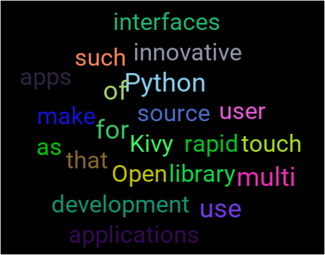

WORDCLOUD
=========

[](https://coveralls.io/github/kivy-garden/wordcloud?branch=master)
[](https://travis-ci.com/kivy-garden/wordcloud)

See https://kivy-garden.github.io/wordcloud/ for the rendered flower docs.

Please see the garden [instructions](https://kivy-garden.github.io) for how to use kivy garden flowers.

Flower information
-------------------

Display words in a cloud-like fashion, with optional animations on them.



[youtube demo](https://youtu.be/NEGK7HAOEkU)


You can execute the module's `__init__.py` file with python to try the example.

Install
---------

```sh
pip install kivy_garden.wordcloud
```

#### Usage

```py
wc = WordCloud(
    label_options=dict(
        font_size=40,
        padding=(10, 10),
    ),
    label_cls='CloudLabel',
    words = (
        'Kivy',
        'Open',
        'source',
        'Python',
        'library',
        'for',
        'rapid',
        'development',
        'of',
        'applications',
        'that',
        'make',
        'use',
        'innovative',
        'user',
        'interfaces',
        'such',
        'as',
        'multi',
        'touch',
        'apps',
    )
)
wc.bind(
    on_post_populate=wc.animate_random_word,
    on_pre_populate=wc.cancel_animate_random_word,
)
root.add_widget(wc)
```

Contributing
------------

Check out our [contribution guide](CONTRIBUTING.md) and feel free to improve the flower.

License
-------

This software is released under the terms of the MIT License.
Please see the [LICENSE.txt](LICENSE.txt) file.

How to release
==============

See the garden [instructions](https://kivy-garden.github.io/#makingareleaseforyourflower) for how to make a new release.
